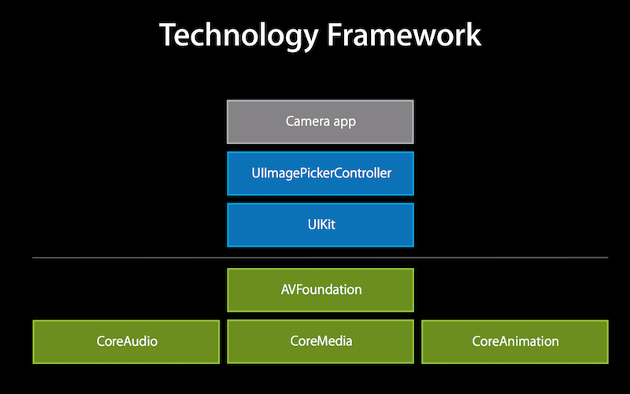
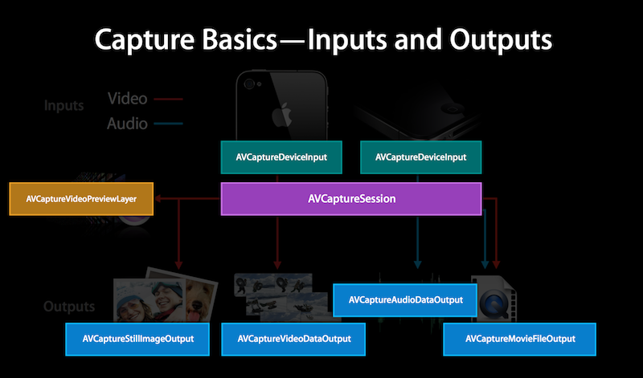

#iOS学习：AVFoundation 视频流处理 - Swift

原文在[此处](https://github.com/100mango/zen)，是ObjC版本，版权属于原作者[100mango](https://github.com/100mango/).

题外话： 需要定制，考虑AVFoundation。

否则，查看UIImagePicker

我只是将文中的代码swiftlize，然后做了一个更简单的Demo.

##框架

首先我们从整体对所需框架做个初步了解。

AVFoundation在相关框架栈中的的位置：

为了捕捉视频,我们需要这样几种类（与其它的子类）。

- AVCaptureDevice 代表了输入设备,例如摄像头与麦克风。
- AVCaptureInput 代表了输入数据源
- AVCaptureOutput 代表了输出数据源
- AVCaptureSession 用于协调输入与输出之间的数据流

并且还有AVCaptureVideoPreviewLayer提供摄像头的预览功能

可以用这样一幅图来概述：

##例子
实际应用AVFoundation来捕捉视频流并不复杂。

Talk is Cheap,Show me the Code.  
我们用代码简单地描述用AVFoundation捕捉视频的过程,其他捕捉音频,静态图像的过程也是大同小异的。

1. 创建AVCaputureSession。
	
	作为协调输入与输出的中心,我们第一步需要创建一个Session
	
	~~~swift
		session = AVCaptureSession()
	~~~
	
2. 创建AVCaptureDevice

	创建一个AVCaptureDevice代表代表输入设备。在这里我们制定设备用于摄像。
	
	~~~swift
	    let device = AVCaptureDevice.defaultDeviceWithMediaType(AVMediaTypeVideo)
	~~~
	
3. 创建AVCaptureDeviceInput,并添加到Session中
	
	我们需要使用AVCaptureDeviceInput来让设备添加到session中, AVCaptureDeviceInput负责管理设备端口。我们可以理解它为设备的抽象。一个设备可能可以同时提供视频和音频的捕捉。我们可以分别用AVCaptureDeviceInput来代表视频输入和音频输入。
	
	~~~swift
	do {
            let input = try AVCaptureDeviceInput(device: device)
            if session.canAddInput(input){
                session.addInput(input)
            }
        } catch {
            print("Error handling the camera Input: \(error)")
            return
        }
	~~~

4. 创建AVCaptureOutput

	为了从session中取得数据,我们需要创建一个AVCaptureOutput
	
	~~~swift
	    videoDataOutput = AVCaptureVideoDataOutput()
	~~~
	
5. 设置output delegate,将output添加至session,在代理方法中分析视频流

	为了分析视频流,我们需要为output设置delegate,并且指定delegate方法在哪个线程被调用。需要主要的是,线程必须是串行的,确保视频帧按序到达。
	
	~~~swift
	videoDataOutputQueue = dispatch_queue_create("VideoDataOutputQueue", DISPATCH_QUEUE_SERIAL)
    videoDataOutput.setSampleBufferDelegate(self, queue: videoDataOutputQueue)
        
    if session.canAddOutput(videoDataOutput) {
            session.addOutput(videoDataOutput)
    }
	~~~
	
	我们可以在delegate方法中分析视频流。
	
	~~~swift
	captureOutput:didOutputSampleBuffer:fromConnection:,
	~~~

6. 开始捕捉

	~~~swift
	session.startRunning()
	~~~

通过上面的简单例子,我么可以看出使用AVFoundation来捕捉视频流并不是十分复杂。重点是使用的过程需要了解配置的细节,还有性能问题。

##实战

学习基础知识过后,让我们用个具体例子来进行阐明。

这里我也用一个更简单的例子来说明问题。

介绍完基本的架构后,我们把精力放回AVFoundation模块上来。在这个项目中, AVFoundation主要负责二维码的扫描与解析。

对于我们这个应用来说,只需两步核心步骤即可。

1. 设置AVFoundation

~~~swift
func setupSession(){
    
    //session
    session = AVCaptureSession()
    //device
    let device = AVCaptureDevice.defaultDeviceWithMediaType(AVMediaTypeVideo)
    //input
    do {
        let input = try AVCaptureDeviceInput(device: device)
        if session.canAddInput(input){
            session.addInput(input)
        }
    } catch {
        print("Error handling the camera Input: \(error)")
        return
    }
    //output
    let output = AVCaptureMetadataOutput()
    session.addOutput(output)
    output.setMetadataObjectsDelegate(self, queue: dispatch_get_main_queue())
    output.metadataObjectTypes = [AVMetadataObjectTypeQRCode]
    
    //add preview layer
    videoPreviewLayer = AVCaptureVideoPreviewLayer(session:session)
    videoPreviewLayer.videoGravity = AVLayerVideoGravityResizeAspectFill
    videoPreviewLayer.frame = view.bounds
    view.layer.addSublayer(videoPreviewLayer)
    
    //start
    session.startRunning()
}
~~~

在这里我们可以看到和上面创建捕捉视频流的步骤基本是一致的。

也就是

1. 创建session
2. 创建device
3. 创建input
4. 创建output。

	这里是与捕捉视频流所不一致的地方。我们捕捉视频流需要的是AVCaptureVideoDataOutput,而在这里我们需要捕捉的是二维码信息。因此我们需要AVCaptureMetadataOutput。并且我们需要指定捕捉的metadataObject类型。在这里我们指定的是AVMetadataObjectTypeQRCode,我们还可以指定其他类型,例如PDF417条码类型。  
	完整的可指定列表可以在[这里](https://developer.apple.com/library/prerelease/ios/documentation/AVFoundation/Reference/AVMetadataMachineReadableCodeObject_Class/index.html#//apple_ref/doc/constant_group/Machine_Readable_Object_Types)找到。
	
	然后我们还要指定处理这些信息的delegate与队列。
	
5. 开始录制
	
	
2.实现代理方法：

~~~swift
func captureOutput(captureOutput: AVCaptureOutput!, didOutputMetadataObjects metadataObjects: [AnyObject]!, fromConnection connection: AVCaptureConnection!) {
    
    for metadataObject in metadataObjects{
        if metadataObject.type == AVMetadataObjectTypeQRCode {
            let metadata = metadataObject as! AVMetadataMachineReadableCodeObject
            let codeCoord = videoPreviewLayer.transformedMetadataObjectForMetadataObject(metadata) as! AVMetadataMachineReadableCodeObject
            borderView.frame = codeCoord.bounds
            
            if let QRValue = metadata.stringValue {
                session.stopRunning()
                QRlabel.text = QRValue
                print(QRValue)
            }
        }
    }
}
~~~

我们需要在代理方法里面接收数据,并根据自己的需求进行处理。
给QRCode添加了一个框并且打印出来结果.

可以在这找到[完整项目](https://github.com/KrisYu/Swift-Qi/tree/master/QRCodeDemo)

##总结

在这里仅仅是通过一个二维码的应用来展示AVFoundation处理视频流能力。事实上，AVFoundation能够做得更多。能够进行剪辑,处理音轨等功能。如果我们需要对视频与音频相关的事务进行处理,不妨在着手处理,寻找第三方解决方案前,看看这个苹果公司为我们带来的强大模块。

PS:最后来点好玩的东西：

大家可以用手机上的微信扫一扫这张二维码（莫慌,虽然稍微有点密集）：

自己用iOS上微信的最新版本进行扫描(版本6.2.0 完成这篇文章的时间是2015.5.27)

是无法完成扫描解析的。自己随机输入一些文字生成二维码进行测试,发现生成二维码的文字如果复杂到一定程度,微信的扫一扫模块是无法扫描解析的。而用QRCatcher是可以准确扫描成功的 :）。欢迎去iTunes下载试用。（请不要嫌我为什么要生成这些密集的二维码 ：）

------------------------

改写于 June 27, 2016 
	
