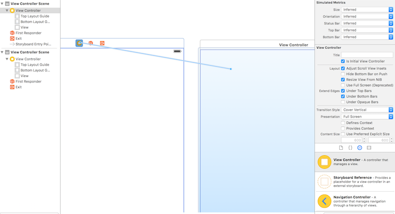

#Segue Without UI Elements

不想要任何UI元素来trigger segue.

这样拖拽形成segue，给这个segue命名，然后在合适的地方调用`performSegueWithIdentifier(String, sender: AnyObject?)`即可达到.

其实Apple很多时候会自己推断这个Animation/Segue应该怎样做，sometimes do what you do, leave the rest infered by Apple.

其实完全可以不用[Demo](https://github.com/KrisYu/Swift-Qi/tree/master/SegueWithoutUIElementsDemo).
